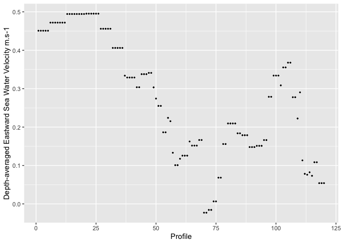

Rollo_python_scripts
================

# Finding datasets of interest

``` r
# load necesssary libraries
library(dplyr)
```

    ## 
    ## Attaching package: 'dplyr'

    ## The following objects are masked from 'package:stats':
    ## 
    ##     filter, lag

    ## The following objects are masked from 'package:base':
    ## 
    ##     intersect, setdiff, setequal, union

``` r
library(ggplot2)
library(lubridate)
```

    ## 
    ## Attaching package: 'lubridate'

    ## The following objects are masked from 'package:base':
    ## 
    ##     date, intersect, setdiff, union

``` r
library(rerddap)
library(plotdap)
```

We can use ERDDAP’s built in search function to find datasets that match
a keyword

### Find drifter datasets from OSMC

``` r
# use 'rerddap::ed_search()' to search the osmc ERDDAP for "drifter"
osmc_erddap <- "https://osmc.noaa.gov/erddap/"
df_osmc <- ed_search("drifter", which = "tabledap", url = osmc_erddap)
head(df_osmc$info)
```

    ##                                                          title
    ## 1 Global Drifter Program - 1 Hour Interpolated QC Drifter Data
    ## 2 Global Drifter Program - 6 Hour Interpolated QC Drifter Data
    ##          dataset_id
    ## 1 drifter_hourly_qc
    ## 2  drifter_6hour_qc

### Find ADCP data on the IOOS sensors ERDDAP

``` r
# use 'rerddap::ed_search()' to search the IOOS Sensor ERDDAP for "adcp"
ioos_sensor_erddap <- "https://erddap.sensors.ioos.us/erddap/"
df_sensor <- ed_search("adcp", which = "tabledap", url = ioos_sensor_erddap)
head(df_sensor$info)
```

    ##                                                    title
    ## 1                            Sunshine Skyway Bridge ADCP
    ## 2      CARICOOS PR1 (Ponce, PR) Buoy: ADCP Currents data
    ## 3   CARICOOS PR2 (San Juan, PR) Buoy: ADCP Currents data
    ## 4    CARICOOS PR3 (Vieques, PR) Buoy: ADCP Currents data
    ## 5 CARICOOS VI1 (St. John, USVI) Buoy: ADCP Currents data
    ## 6                          Mooring OB27M, Onslow Bay, NC
    ##                         dataset_id
    ## 1           noaa_nos_co_ops_t01010
    ## 2 ism-caricoos-pr1_doppler_5e96_75
    ## 3 ism-caricoos-pr2_doppler_34d7_c6
    ## 4 ism-caricoos-pr3_doppler_b3ca_6d
    ## 5 ism-caricoos-vi1_doppler_200f_7a
    ## 6      mooring-ob27m-onslow-bay-nc

### Search with allDatasets

For a more sophisticated search, we can use the `allDatasets` dataset
from ERDDAP to examine the primary metadata of all datasets.

### Get metadata for IOOS glider datasets

``` r
# access from the IOOS Glider DAC using 'rerddap::tabledap()"  the "allDatasets" response - https://gliders.ioos.us/erddap/allDatasets.html
ioos_gliders_erddap <- "https://gliders.ioos.us/erddap"
info <- info("allDatasets", url = ioos_gliders_erddap)
df <- tabledap(info)
```

    ## info() output passed to x; setting base url to: https://gliders.ioos.us/erddap

    ## Warning in set_units(temp_table, dds): NAs introduced by coercion

    ## Warning in set_units(temp_table, dds): NAs introduced by coercion

``` r
# list the column names to keep
keep <- c('institution',
           'minLongitude',
           'maxLongitude',
           'minLatitude',
           'maxLatitude',
           'minAltitude',
           'maxAltitude',
           'minTime',
           'maxTime')
# how to do the select in base R
# df_gliders<- subset(df, select = keep)
#
# use 'dplyr::select()' to select desired columns
df_gliders <- select(df, all_of(keep))
# unhappy if class "tabledap" remains,  remove it
class(df_gliders) <- "data.frame"
# use 'lubridate::as_datetime()' to convert "maxTime" and "minTime" to R datetime objects
df_gliders$maxTime <- as_datetime(df_gliders$maxTime)
df_gliders$minTime <- as_datetime(df_gliders$minTime)
head(df_gliders)
```

    ##                                             institution minLongitude
    ## 2                                  Axiom Docker Install          NaN
    ## 3 Virginia Institute of Marine Science - William & Mary    -75.07958
    ## 4 Virginia Institute of Marine Science - William & Mary    -75.36032
    ## 5 Virginia Institute of Marine Science - William & Mary    -74.94786
    ## 6      NOAA SWFSC Antarctic Ecosystem Research Division    -61.75637
    ## 7      NOAA SWFSC Antarctic Ecosystem Research Division    -61.66719
    ##   maxLongitude minLatitude maxLatitude   minAltitude maxAltitude minTime
    ## 2          NaN         NaN         NaN           NaN         NaN    <NA>
    ## 3    -74.44579    37.40444    37.53960 -1.040000e+00   -351.1800    <NA>
    ## 4    -74.44381    36.33492    37.35371  2.511368e-02   -323.9919    <NA>
    ## 5    -74.40501    37.04239    37.66257 -2.014898e-02   -344.7628    <NA>
    ## 6    -56.99647   -63.46532   -62.20300 -1.315100e-14  -1003.8600    <NA>
    ## 7    -57.43316   -63.55593   -62.18683 -3.265242e-15   -962.1450    <NA>
    ##   maxTime
    ## 2    <NA>
    ## 3    <NA>
    ## 4    <NA>
    ## 5    <NA>
    ## 6    <NA>
    ## 7    <NA>

### Which gliders have uploaded data in the last 6 hours?

``` r
# use 'lubridate::now()' to get present time as an R datetime object, create new column wiht deploy time
df_gliders$deploy <- now() - df_gliders$maxTime
# use 'dplyr::filter()' to find deploy time less than 6 hours
latest_gliders <- filter(df_gliders, (deploy < 6.))
head(latest_gliders)
```

    ##  [1] institution  minLongitude maxLongitude minLatitude  maxLatitude 
    ##  [6] minAltitude  maxAltitude  minTime      maxTime      deploy      
    ## <0 rows> (or 0-length row.names)

### Find datasets from deployments that lasted longer than 90 days

``` r
# use 'dplyr::filter()' to find deploy time greater than 90 days
longest_gliders <- filter(df_gliders, time_length(maxTime - minTime) > 90)
head(longest_gliders)
```

    ##  [1] institution  minLongitude maxLongitude minLatitude  maxLatitude 
    ##  [6] minAltitude  maxAltitude  minTime      maxTime      deploy      
    ## <0 rows> (or 0-length row.names)

### Which glider missions extended to a depth of greater than 150 m in seas north of 70 N?

``` r
# use 'dplyr::filter()' to find deploy observations on the latitude/depth range
deep_gliders <- filter(df_gliders, (maxLatitude >= 70) & (minAltitude < -150))
head(deep_gliders)
```

    ##  [1] institution  minLongitude maxLongitude minLatitude  maxLatitude 
    ##  [6] minAltitude  maxAltitude  minTime      maxTime      deploy      
    ## <0 rows> (or 0-length row.names)

``` r
# use 'rerddap::tabledap()' to get from 'profile_id', 'time', 'u' from gilder "unit_595-20180804T0000-delayed'
info <- info("unit_595-20180804T0000-delayed", url = ioos_gliders_erddap)
alaska_glider <- tabledap("unit_595-20180804T0000-delayed",
                          fields = c('profile_id', 'time', 'u'),
                          'time>=2018-09-20',
                          url = ioos_gliders_erddap
                   )
# convert character "NaN" to NA
alaska_glider$u[alaska_glider$u == "NaN"] <- NA
# use 'dplyr::filter()' to remove NA
alaska_glider <- filter(alaska_glider, all_of(!is.na(u)))
```

    ## Warning: There was 1 warning in `filter()`.
    ## ℹ In argument: `all_of(!is.na(u))`.
    ## Caused by warning:
    ## ! Using `all_of()` outside of a selecting function was deprecated in tidyselect
    ##   1.2.0.
    ## ℹ See details at
    ##   <https://tidyselect.r-lib.org/reference/faq-selection-context.html>

``` r
# convert alaska_glider$u to numeric values
alaska_glider$u <- as.numeric(alaska_glider$u )
# get parameter long_name and units from the 'info()' call
ylab = paste(info$alldata$u$value[9], info$alldata$u$value[13])
# plot using "ggplot()"
ggplot()  + 
    geom_point(data = alaska_glider , aes(y = u, x= 1:(length(u))), size = .5) +
    xlab('Profile') + ylab(ylab) 
```

<!-- -->

------------------------------------------------------------------------

### References

IOOS ERDDAP <https://gliders.ioos.us/erddap>

More info on using ERDDAP’s inbuilt search
<https://ioos.github.io/erddapy/01b-tabledap-output.html>
