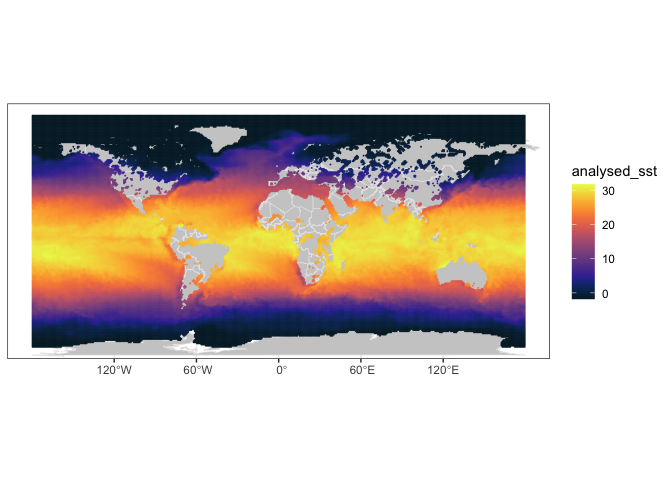
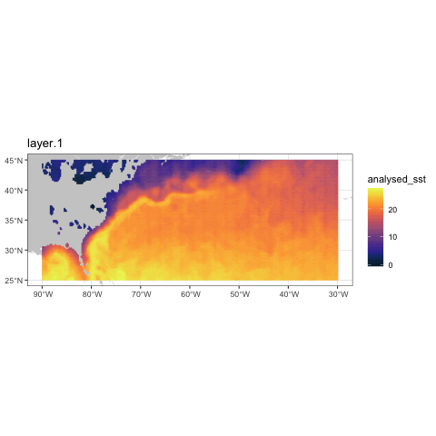
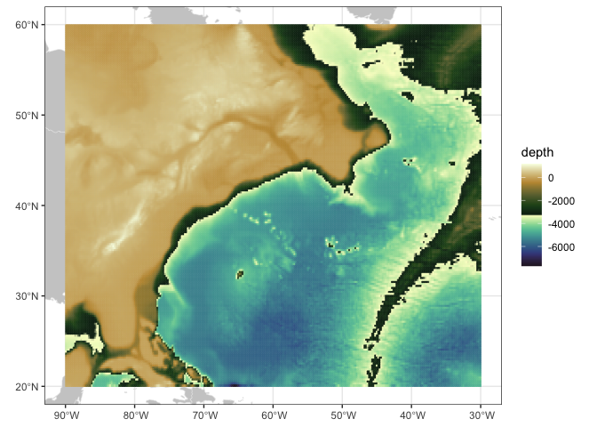

02_gridded_data
================

# Gridded datasets

ERDDAP has a seperate mechanism for gridded data, like satellite and
model/reanalysis products. This is called griddap.

    ## 
    ## Attaching package: 'dplyr'

    ## The following objects are masked from 'package:stats':
    ## 
    ##     filter, lag

    ## The following objects are masked from 'package:base':
    ## 
    ##     intersect, setdiff, setequal, union

### Specify server and protocol

Here we use a hi-res SST product from JPL via the coastwatch server
<https://coastwatch.pfeg.noaa.gov/erddap/griddap/jplMURSST41.html>

``` r
# use 'rerddap::griddap()' to download MUR data
wcn_erddap <- "https://coastwatch.pfeg.noaa.gov/erddap"
dataset_id <- 'jplMURSST41'
mur_info <- info(dataset_id, url = wcn_erddap)
stride <- c(1, 10, 10)
mur <- griddap( mur_info, 
                fields = 'analysed_sst', 
                stride = stride, 
                time = c('last','last'), 
                longitude = c(-179.99, 180), 
                latitude = c(-89.99, 89.99)
                )
```

    ## info() output passed to x; setting base url to: https://coastwatch.pfeg.noaa.gov/erddap

``` r
# use 'plotdap::add_griddap()' to make quick plot of the data
p <- plotdap() 
```

    ## Loading required package: maps

``` r
p <- add_griddap(p, mur, ~analysed_sst, fill = "thermal", maxpixels = 100000)
```

    ## grid object contains more than 1e+05 pixels

    ## increase `maxpixels` for a finer resolution

``` r
p
```

<!-- -->

Gridded datasets can be very large. By default, erddapy returns only the
most recent time slice of a dataset. This behaviour can be changed by
adjusting the constraints, much like with tabledap. The mechanism for
subsetting griddap data is a little more complicated, as the data are
multi-dimensional.

Let’s zoom in on the Gulf Stream and take a few time slices. To achieve
this, we modify the constraints. We will tighten the lon/lat to a window
of interest and request a wider timespan of data, taking every 30th day
over the last few years

``` r
# use 'rerddap::griddap()' to get the data
mur <- griddap( mur_info, 
                 fields = 'analysed_sst', 
                 stride = c(30, 1, 1),
                 time = c('2023-01-01','2023-05-01'), 
                 longitude = c(-90, -30), 
                 latitude = c(25, 45)
                 )
# use 'plotdap::add_griddap()' to do an animated mapping of the data
# this can take awhile to render
p <- plotdap() 
add_griddap(p, mur, ~analysed_sst, fill = "thermal", maxpixels = 30000, time = identity, animate = TRUE)
```



### extra example: low-res topography

``` r
wcn_erddap <- "https://coastwatch.pfeg.noaa.gov/erddap/"
bathy_info <- info("etopo180", url = wcn_erddap)
latitude <- c(20, 60)
longitude <- c(-90, -30)
bathy <- rxtracto_3D(bathy_info,
                 parameter = 'altitude',
                 ycoord = latitude,
                 xcoord = longitude,
                 )

plotBBox(bathy, plotColor = 'topo', maxpixels = 50000)
```

    ## grid object contains more than 50000 pixels

    ## increase `maxpixels` for a finer resolution

<!-- -->

------------------------------------------------------------------------

### References

coastwatch ERDDAP <https://coastwatch.pfeg.noaa.gov/erddap/index.html>

For more information on how erddapy deals with griddap, see the [erddapy
documentation example
notebook](https://ioos.github.io/erddapy/01a-griddap-output.html)
