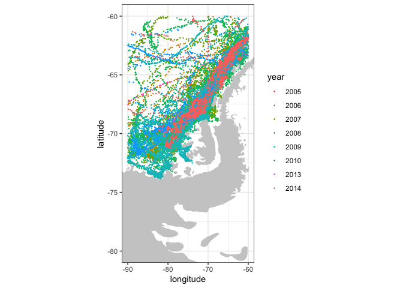
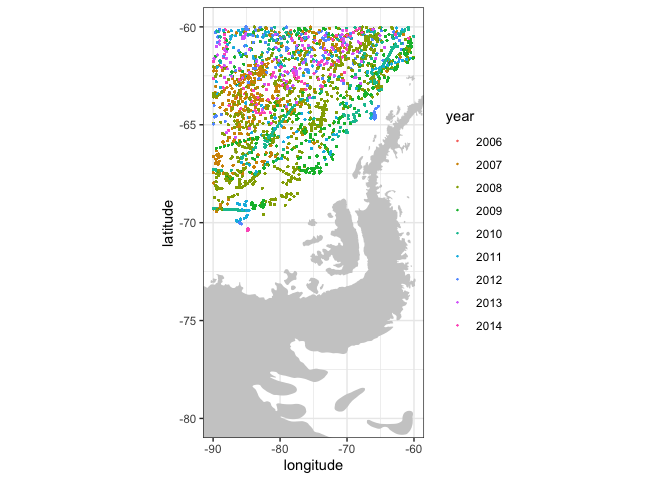
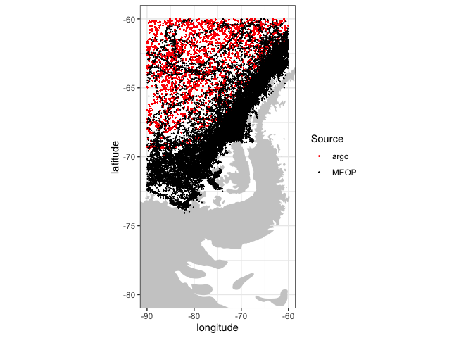
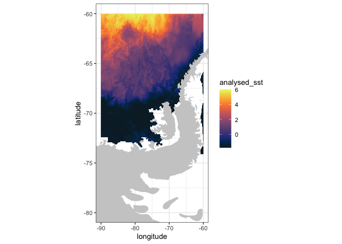
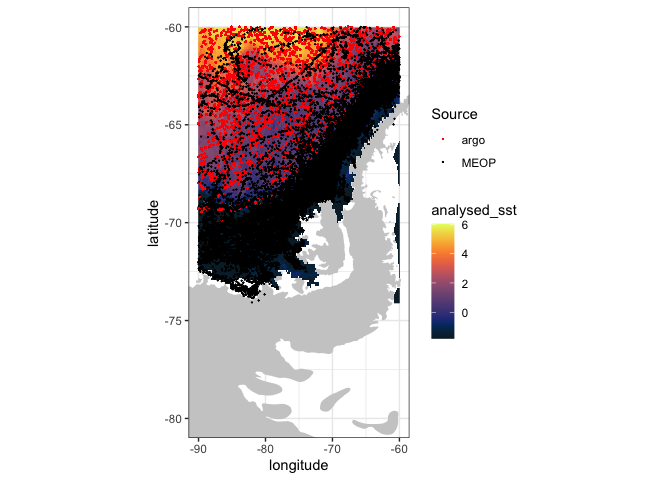

03_combine_dataset
================

Combine results from multiple ERDDAPs

In this notebook we use data from one ERDDAP (OSMC animal-borne sensors)
to make subsequent queries to other ERDDAPs supplying Argo and satellite
data

    ## 
    ## Attaching package: 'dplyr'

    ## The following objects are masked from 'package:stats':
    ## 
    ##     filter, lag

    ## The following objects are masked from 'package:base':
    ## 
    ##     intersect, setdiff, setequal, union

    ## 
    ## Attaching package: 'lubridate'

    ## The following objects are masked from 'package:base':
    ## 
    ##     date, intersect, setdiff, union

    ## Loading required package: maps

1.  MEOPS animals

We can use ERDDAP’s built in search function to find datasets that match
a keyword. Let’s find some animal borne sensor data

``` r
# use ERDDAP search through 'rerddap::ed_search()'
osmc_erddap <- "https://osmc.noaa.gov/erddap/"
animals <- ed_search("animal", which = "tabledap", url = osmc_erddap)
head(animals$info)
```

    ##                  title    dataset_id
    ## 1 meop animal profiles MEOP_profiles

``` r
# use ERDDAP search through 'rerddap::tabledap()' 
# to obtain all "Southern ellie  records
df_MEOP_info <- info("MEOP_profiles", url = osmc_erddap )
df_MEOP <- tabledap(df_MEOP_info, 
               fields = c('latitude', 'longitude', 'time', 'species'),
               'species="Southern ellie"',
               'longitude>=-90',
               'longitude<=-60',
               'latitude<=-60',
                url = osmc_erddap
               )
```

    ## info() output passed to x; setting base url to: https://osmc.noaa.gov/erddap

``` r
# convert latitude and longitude to numeric
df_MEOP$latitude <- as.numeric(df_MEOP$latitude)
df_MEOP$longitude <- as.numeric(df_MEOP$longitude)
# convert time to datetime using 'lubridate::as_datetime()'
df_MEOP$time <- as_datetime(df_MEOP$time)
# and as a factor a year column using 'lubridate::year()'
df_MEOP$year <- as.factor(year(df_MEOP$time))
df_MEOP$source <- rep('MEOP', length(df_MEOP$time))
head(df_MEOP)
```

    ## <ERDDAP tabledap> MEOP_profiles
    ##    Path: [/var/folders/46/jyz1mm5x5bvbf59b5g8f7f580000gn/T//RtmpfcQprC/R/rerddap/ce5619e2443aa78b7f820072c0db77e6.csv]
    ##    Last updated: [2024-03-20 20:48:18.710922]
    ##    File size:    [1.84 mb]
    ## # A tibble: 6 × 6
    ##   latitude longitude time                species        year  source
    ##      <dbl>     <dbl> <dttm>              <chr>          <fct> <chr> 
    ## 1    -63.0     -60.2 2013-12-08 01:12:00 Southern ellie 2013  MEOP  
    ## 2    -63.1     -60.5 2013-12-08 05:33:00 Southern ellie 2013  MEOP  
    ## 3    -63.1     -60.6 2013-12-08 06:43:00 Southern ellie 2013  MEOP  
    ## 4    -63.1     -60.9 2013-12-08 09:41:00 Southern ellie 2013  MEOP  
    ## 5    -63.2     -61.0 2013-12-08 10:51:00 Southern ellie 2013  MEOP  
    ## 6    -63.2     -61.1 2013-12-08 14:48:00 Southern ellie 2013  MEOP

``` r
# plot using ggplot2
# set plot limits
xlim <- c(-90, -60)
ylim <- c(-80, -60)
# get hi-res map outline
w <- map_data("worldHires", ylim = ylim, xlim = xlim)
# plot both layers
p <- ggplot() +
    geom_point(data = df_MEOP, aes(x = longitude, y = latitude, colour = year), size = 0.1) +
    geom_polygon(data = w, aes(x = long, y = lat, group = group), fill = "grey80") +
    coord_quickmap(xlim = xlim, ylim = ylim) +
    theme_bw() + 
    ylab("latitude") + xlab("longitude")
p  
```

<!-- -->

2.  Add argo data

We use a bounding box from the lon, lat and time of the seal data to
look for co-located Argo floats on the ifremer ERDDAP

``` r
argo_erddap <- 'https://erddap.ifremer.fr/erddap/'
# get info for the argo data
argo_erddap_info <- info("ArgoFloats", url = argo_erddap)
# get the field names from the info result
fields <- argo_erddap_info$variables$variable_name
# set the contraints based on the MEOP download
time_min_constraint <- paste0('time>=', min(df_MEOP$time))
time_max_constraint <- paste0('time<=', max(df_MEOP$time))
lat_min_constraint <- paste0('latitude>=', min(df_MEOP$latitude))
lat_max_constraint <- paste0('latitude<=', max(df_MEOP$latitude))
lon_min_constraint <- paste0('longitude>=', min(df_MEOP$longitude))
lon_max_constraint <- paste0('longitude<=', max(df_MEOP$longitude))
# obtain argo data using tabledap
df_argo <- tabledap(argo_erddap_info,
                    fields = fields,
                    time_min_constraint,
                    time_max_constraint,
                    lat_min_constraint,
                    lat_max_constraint,
                    lon_min_constraint,
                    lon_max_constraint,
                    url = argo_erddap 
                    )
```

    ## info() output passed to x; setting base url to: https://erddap.ifremer.fr/erddap

    ## Warning in set_units(temp_table, dds): NAs introduced by coercion

    ## Warning in set_units(temp_table, dds): NAs introduced by coercion

    ## Warning in set_units(temp_table, dds): NAs introduced by coercion

    ## Warning in set_units(temp_table, dds): NAs introduced by coercion

``` r
# convert latitdue and longitude to numerics
df_argo$latitude <- as.numeric(df_argo$latitude)
df_argo$longitude <- as.numeric(df_argo$longitude)
# convert time to R datetime
df_argo$time <- as_datetime(df_argo$time)
# create new column for year
df_argo$year <- as.factor(year(df_argo$time))
df_argo$source <- rep('argo', length(df_argo$time))
# map the data
xlim <- c(-90, -60)
ylim <- c(-80, -60)
w <- map_data("worldHires", ylim = ylim, xlim = xlim)
ggplot() +
    geom_point(data = df_argo, aes(x = longitude, y = latitude, colour = year), size = 0.1) +
    geom_polygon(data = w, aes(x = long, y = lat, group = group), fill = "grey80") +
    coord_quickmap(xlim = xlim, ylim = ylim) +
    theme_bw() + 
    ylab("latitude") + xlab("longitude")
```

<!-- -->

now compare the two datasets across time:

``` r
xlim <- c(-90, -60)
ylim <- c(-80, -60)
w <- map_data("worldHires", ylim = ylim, xlim = xlim)
ggplot() +
    geom_polygon(data = w, aes(x = long, y = lat, group = group), fill = "grey80") +
    geom_point(data = df_argo, aes(x = longitude, y = latitude, color = source,), size  = 0.05, show.legend = TRUE) +
    #scale_fill_manual(values = ('Argo' = 'red') )+
    geom_point(data = df_MEOP, aes(x = longitude, y = latitude, color = source), size = 0.05, show.legend = TRUE) + 
         #scale_fill_manual(values= ('MEOP' ='black')) +   
    labs(x = 'longitude',
         y = 'latitude',
         color = 'Source') +
    scale_color_manual(values=c('argo' = 'red', 'MEOP' ='black')) +
    coord_quickmap(xlim = xlim, ylim = ylim)  +
    theme_bw() 
```

<!-- -->

3.  Gridded SST

Finally, we get some matching JPL reanalysis SST data from the
Coastwatch West Coast Node (wcn) ERDDAP

``` r
wcn_erddap <- 'https://coastwatch.pfeg.noaa.gov/erddap'
# get info for the MUR data
mur_info <- info('jplMURSST41', url = wcn_erddap)
# set constraints based on MEOP data
time <- as.character(c(min(df_MEOP$time), max(df_MEOP$time)))
latitude <- c(min(df_MEOP$latitude), max(df_MEOP$latitude))
longitude <- c( min(df_MEOP$longitude),  max(df_MEOP$longitude))
# because of possible size of extract,  "thin" the request
stride <- c(365, 10, 10)
# extract data using gridddap
sst <- griddap(mur_info,
               fields = 'analysed_sst',
               stride = stride,
               time = time,
               latitude = latitude,
               longitude = longitude,
               url = wcn_erddap
               )
```

    ## info() output passed to x; setting base url to: https://coastwatch.pfeg.noaa.gov/erddap

# plot against first time

``` r
xlim <- c(-90, -60)
ylim <- c(-80, -60)
first_time <- filter(sst$data, time == "2005-02-13T09:00:00Z")
mycolor <- colors$temperature
w <- map_data("worldHires", ylim = ylim, xlim = xlim)
ggplot(data = first_time, aes(x = longitude, y = latitude, fill = analysed_sst)) +
    geom_polygon(data = w, aes(x = long, y = lat, group = group), fill = "grey80") +
    geom_raster(interpolate = FALSE) +
    scale_fill_gradientn(colours = mycolor, na.value = NA) +
    theme_bw() + ylab("latitude") + xlab("longitude") +
    coord_quickmap(xlim = xlim, ylim = ylim) 
```

<!-- -->

``` r
xlim <- c(-90, -60)
ylim <- c(-80, -60)
w <- map_data("worldHires", ylim = ylim, xlim = xlim)
ggplot() +
    geom_polygon(data = w, aes(x = long, y = lat, group = group), fill = "grey80") +
    geom_raster(data = first_time, aes(x = longitude, y = latitude, fill = analysed_sst), interpolate = FALSE) +
    scale_fill_gradientn(colours = mycolor, na.value = NA) +
    geom_point(data = df_argo, aes(x = longitude, y = latitude, color = source,), size  = 0.05, show.legend = TRUE) +
    geom_point(data = df_MEOP, aes(x = longitude, y = latitude, color = source), size = 0.05, show.legend = TRUE) + 
    labs(x = 'longitude',
         y = 'latitude',
         color = 'Source') +
    scale_color_manual(values=c('argo' = 'red', 'MEOP' ='black')) +
    coord_quickmap(xlim = xlim, ylim = ylim)  +
    theme_bw() 
```

<!-- -->

We will cover more on the use of the griddap protocol in the next
session

Bonus: change the species to ‘Crabeater seal’ and re-run the notebook

References

MEOP data from <https://meop.net>

Argo data from ifremer
<https://erddap.ifremer.fr/erddap/tabledap/ArgoFloats.html>

SST reanalysis from coastwatch <https://coastwatch.pfeg.noaa.gov/erddap>

More info on using ERDDAP’s inbuilt search
<https://ioos.github.io/erddapy/01b-tabledap-output.html>
