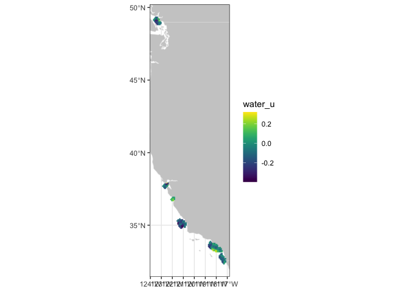
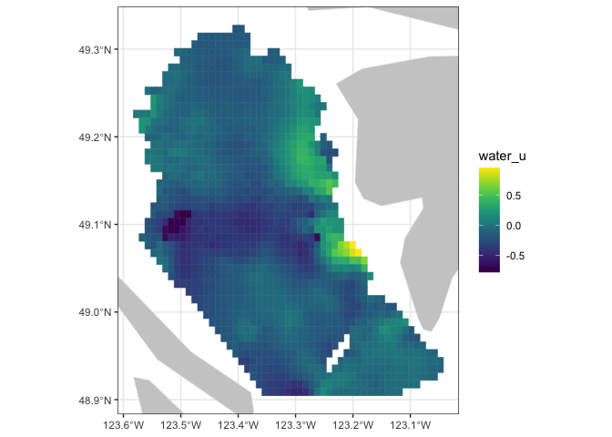
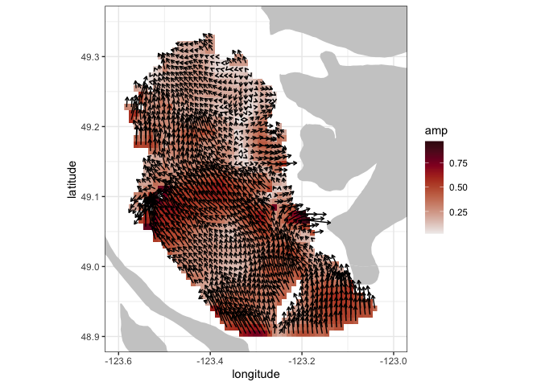
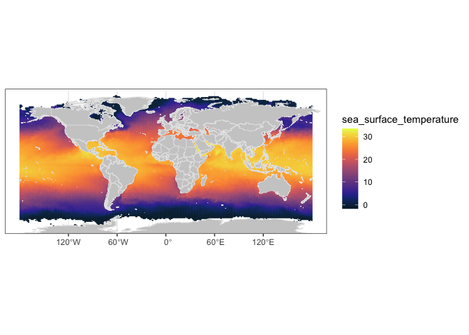

04_more_erddap
================

# Miscellaneous ERDDAP functionality

### Get metadata

To see detailed metadata from a dataset, use the ‘rerddap::info()’
function

``` r
voto_erddap <- "https://erddap.observations.voiceoftheocean.org/erddap"
glider_info <- info("nrt_SEA068_M27", url = voto_erddap)
```

### Display vector data

Using some HF Radar from coastwatch

<https://coastwatch.pfeg.noaa.gov/erddap/griddap/ucsdHfrW1.html>

``` r
wcn_erddap <- "https://coastwatch.pfeg.noaa.gov/erddap/"
hf_radar_info <- rerddap::info('ucsdHfrW1', url = wcn_erddap)
```

Coarsen by 10’000 and make a quick plot

``` r
lat_bound <- hf_radar_info$alldata$latitude$value[3]
lat_bound <- as.numeric(unlist(strsplit(lat_bound, ",")))
lon_bound <- hf_radar_info$alldata$longitude$value[3]
lon_bound <- as.numeric(unlist(strsplit(lon_bound, ",")))
#global <- hf_radar_info$alldata$NC_GLOBAL
#time_bound <- rev(global[ global$attribute_name %in%
#                   c('time_coverage_end','time_coverage_start'), "value", ])
time_bound <- c('2023-10-17T12:00:00Z', '2023-10-17T12:00:00Z')
stride <- c(1, 100, 100)
hf_radar <- griddap('ucsdHfrW1',
                    fields = c('water_u', 'water_v'),
                    time = time_bound,
                    latitude = lat_bound,
                    longitude = lon_bound,
                    url = wcn_erddap
                    )
p <- plotdap()
```

    ## Loading required package: maps

``` r
add_griddap(p, hf_radar, ~water_u, maxpixels = 50000)
```

    ## grid object contains more than 50000 pixels

    ## increase `maxpixels` for a finer resolution

<!-- -->

Constrain the data to a smaller region for plotting

``` r
lat_bound <- c(48.9, 49.35)
lon_bound <- c(-123.6, -123.)
hf_radar <- griddap('ucsdHfrW1',
                    fields = c('water_u', 'water_v'),
                    time = time_bound,
                    latitude = lat_bound,
                    longitude = lon_bound,
                    url = wcn_erddap
                    )

p <- plotdap()
add_griddap(p, hf_radar, ~water_u, maxpixels = 50000)
```

<!-- -->

Plot the water current vectors on the magnitude:

``` r
temp_df <- hf_radar$data
temp_df$amp <- sqrt(temp_df$water_u^2 + temp_df$water_v^2)
temp_df$direction <- atan2(temp_df$water_v, temp_df$water_u)
w <- map_data("worldHires", ylim = lat_bound, xlim = lon_bound)
my_color <- cmocean('amp')(256)
ggplot() + 
  geom_raster(data =temp_df, aes(x = longitude, y = latitude, fill = amp ), interpolate = FALSE) +
  scale_fill_gradientn(colours = my_color, na.value = NA) + 
  geom_polygon(data = w, aes(x = long, y = lat, group = group), fill = "grey80") +
  geom_spoke(data = temp_df, aes(x = longitude, y = latitude, 
                                 radius = scales::rescale(amp, c(0., .05)),
                                 angle = direction),
             arrow = arrow(length = unit(.05, 'inches'))
  ) +
  coord_quickmap(xlim = lon_bound, ylim = lat_bound) +
  theme_bw() + 
  ylab("latitude") + xlab("longitude")
```

<!-- -->

### Display satellite data

Pathfinder SST

<https://coastwatch.pfeg.noaa.gov/erddap/griddap/erdPH53sstdmday.graph>

Obtain information about the dataset

``` r
wcn_erddap <- "https://coastwatch.pfeg.noaa.gov/erddap/"
datasetID <- 'erdPH53sstdmday'
pathfinder_info <- info(datasetID, url = wcn_erddap )
```

Download the data:

``` r
stride <- c(1, 100, 100)
time_bound <- c('last', 'last')
lat_bound <- pathfinder_info$alldata$latitude$value[3]
lat_bound <- as.numeric(unlist(strsplit(lat_bound, ",")))
lon_bound <- pathfinder_info$alldata$longitude$value[3]
lon_bound <- as.numeric(unlist(strsplit(lon_bound, ",")))
parameter <- 'sea_surface_temperature'
sst <- griddap(pathfinder_info,
                    fields = parameter,
                    time = time_bound,
                    latitude = lat_bound,
                    longitude = lon_bound,
                    url = wcn_erddap
                    )
```

    ## info() output passed to x; setting base url to: https://coastwatch.pfeg.noaa.gov/erddap

``` r
# get rid of junk values
sst$data$sea_surface_temperature[sst$data$sea_surface_temperature < -2] <- NA 
sst$data$sea_surface_temperature[sst$data$sea_surface_temperature > 40] <- NA 
```

``` r
p <- plotdap()
add_griddap(p, sst, ~sea_surface_temperature, fill = "thermal", maxpixels = 50000) |>
     print(landmask = TRUE)
```

    ## grid object contains more than 50000 pixels

    ## increase `maxpixels` for a finer resolution

<!-- -->
